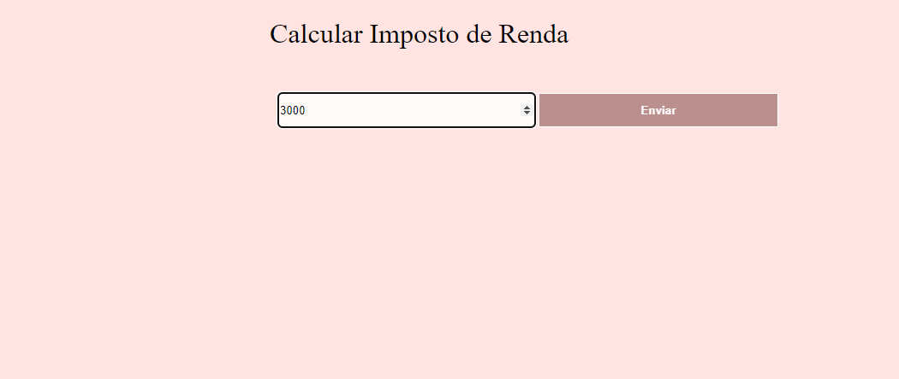
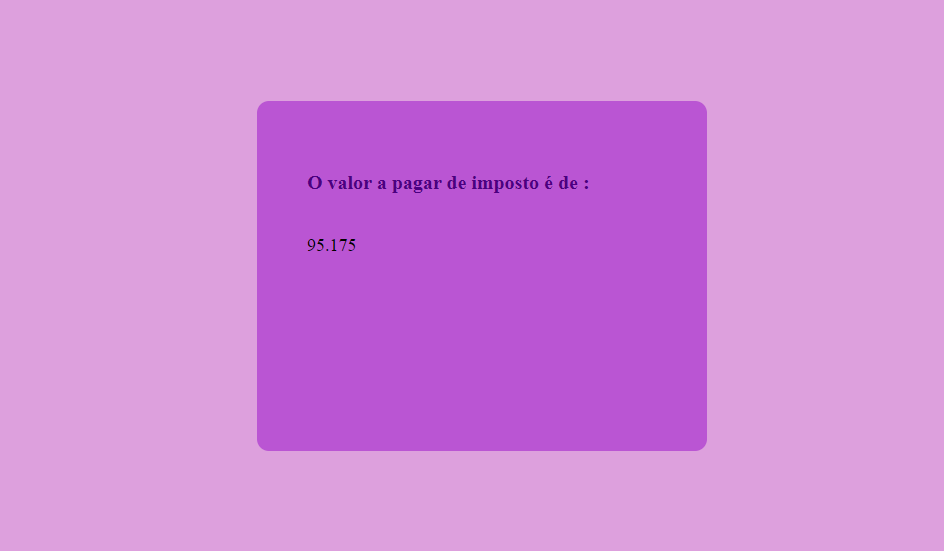

# Imposto

# Imposto :package:

<h1>Description and Funcionalities :books:</h1>
This project has the function of calculating income tax, based on defined metrics (rates).
On the first page it asks for the person's salary, and on the second page, it tells you how
much tax you should pay. It was developed in:

<ul>
  <li>HTML</li>
   <li>CSS</li>
   <li>Java</li>

</ul

<h1>How to use :books:</h1>
To open this project on your machine it is necessary to have the Java SDK installed and some IDE, 
such as Eclipse, IntelliJ IDEA or NetBeans. Download it, configure it on the machine and open the files.
You need to create a file to store the defined metrics.The metrics are: the minimum value, the maximum 
value and the rate, respectively. The name of the file is imposto.app, and it must be created inside
a folder called estudos.

<h1>Funcionalities</h1>

<h1>Authors</h1>
Giovanna Cruz dos Santos(only me)
